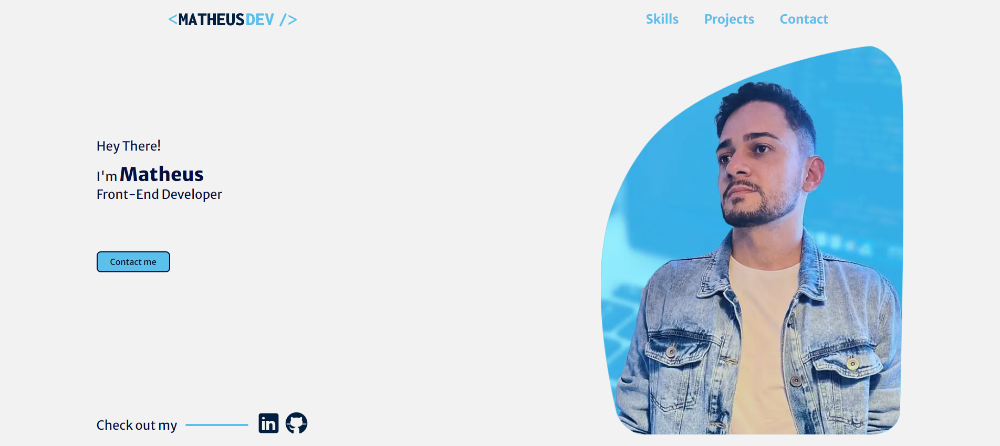

<h3 align="center">
  
   
</h3>

  <strong>Porfolio</strong> is where you can find a little about me, my skills and experiences where I've worked.

  

# 📂 Table of Contents

- [Technology](#technology)
- [In Action](#in-action)
- [License](#license)

## 💡 Technology

The project was developed with the following technologies:

- [HTML](https://html.com/) is a HyperText Markup Language that allows the creation and structure of sections, paragraphs, links and others tags.
- [CSS](https://www.w3.org/Style/CSS/Overview.en.html) or Cascading Style Sheets (CSS) is a simple mechanism for adding style, fonts, colors, spacing to Web documents.
- [Javascript](https://www.javascript.com/) is a scripting language for creating dynamic web page content.

## 📸	In Action

You can check it out [here](https://dev-almeida-matheus.vercel.app/).

## 📝 License

This project is under the MIT license. see the [license page](https://opensource.org/licenses/MIT) for more details.

<h4 align="center">
  Made with ❤️ by <a href="https://www.linkedin.com/in/matheus-almeida-602139182/" target="_blank">Matheus Almeida</a>
</h4>